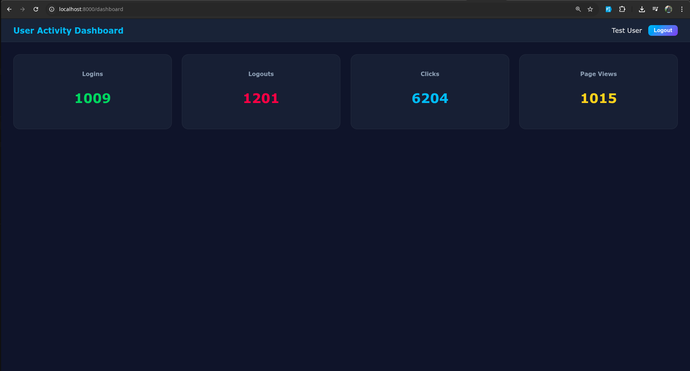
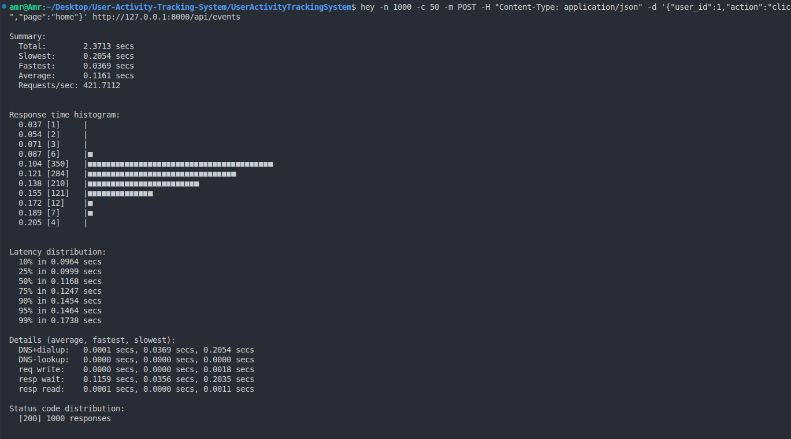
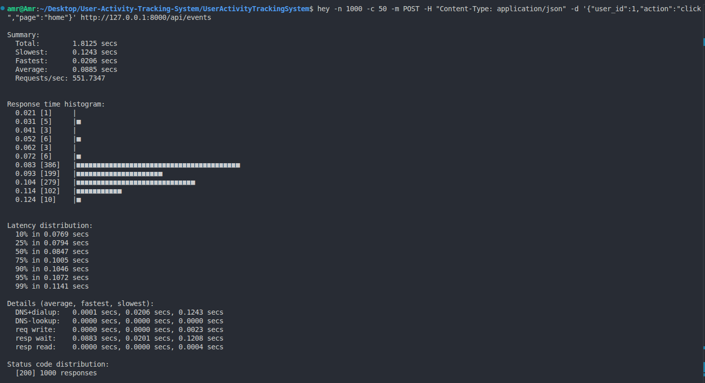

# 📌 About This Project

**User Activity Tracking System** is a scalable real-time user activity monitoring system built with Laravel, Livewire, Redis, and MySQL. The system handles high-frequency events such as logins, logouts, and page views using asynchronous queues, stores them efficiently in the database, and provides a real-time dashboard for monitoring KPIs.

---

## 🚀 Features

- Real-time dashboard with KPI cards (logins, logouts, active users).  
- Async event processing using Laravel Queues & Redis.  
- Per-user and global rate limiting for /events endpoint.  
- Event indexing for faster queries.  
- Load testing support for high-frequency events.  
- Responsive Livewire UI with Blade templates.  

---

## 🖼️ Screenshots

### Dashboard

  

### Test 1

  

### Test 2

  

---

## 🛠️ Tech Stack

- **Backend:** Laravel 12, Redis, MySQL  
- **Frontend:** Livewire, Blade, Tailwind CSS  
- **Dev Tools:** Docker (optional), Queue Worker  
- **Testing:** Load testing via cURL or Postman Runner